# Helpdesk Lab & Automation Toolkit

A home-built Active Directory lab simulating real help desk scenarios, paired with PowerShell scripts to automate the tickets I handle daily as a Tier 1 support technician (account unlocks, password resets, role/group management).

## Why this project
I work help desk support for a CMS Identity Management system, handling account unlocks, MFA troubleshooting, password resets, and role requests. This lab recreates that environment at home so I can document, automate, and demonstrate the same skills.

## Environment
- **Hypervisor:** Oracle VM VirtualBox
- **Domain Controller:** Windows Server 2022 Standard Evaluation (Desktop Experience)
- **Domain:** corp.local
- **Network:** Isolated internal network (not exposed to host network)

## Build Log

### Day 1 — Domain Controller Setup

**VM Setup:**
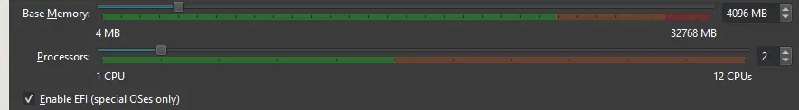
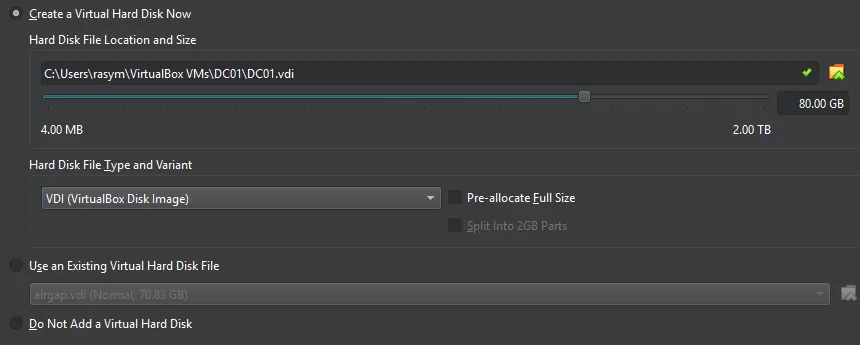
- Installed VirtualBox and configured an isolated internal network for the lab.
- Downloaded Windows Server 2022 Evaluation and Windows 11 Enterprise Evaluation ISOs.
- Created the DC01 VM (4GB RAM, 80GB dynamic disk).

**Mistake #1 — caught a wrong ISO before it caused a problem:**
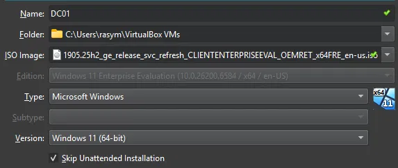
- Initially had the Windows 11 client ISO attached instead of the Server ISO — caught it before installing and corrected it.

**Mistake #2 — ran out of host disk space mid-install:**
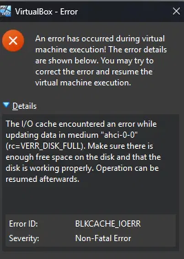
- Hit a disk-full error mid-install due to low host drive space.
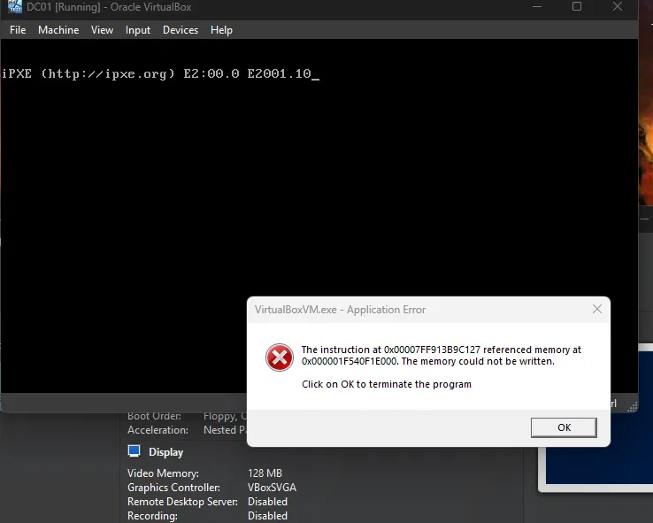
- The interrupted install left a corrupted virtual disk that failed to boot on restart.
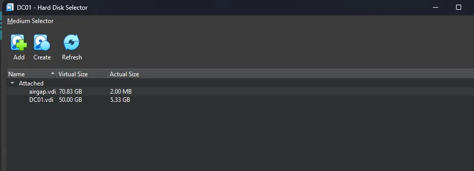
- Freed up host disk space, deleted the broken virtual disk, and created a fresh one.

**Mistake #3 — installed the wrong Windows edition:**
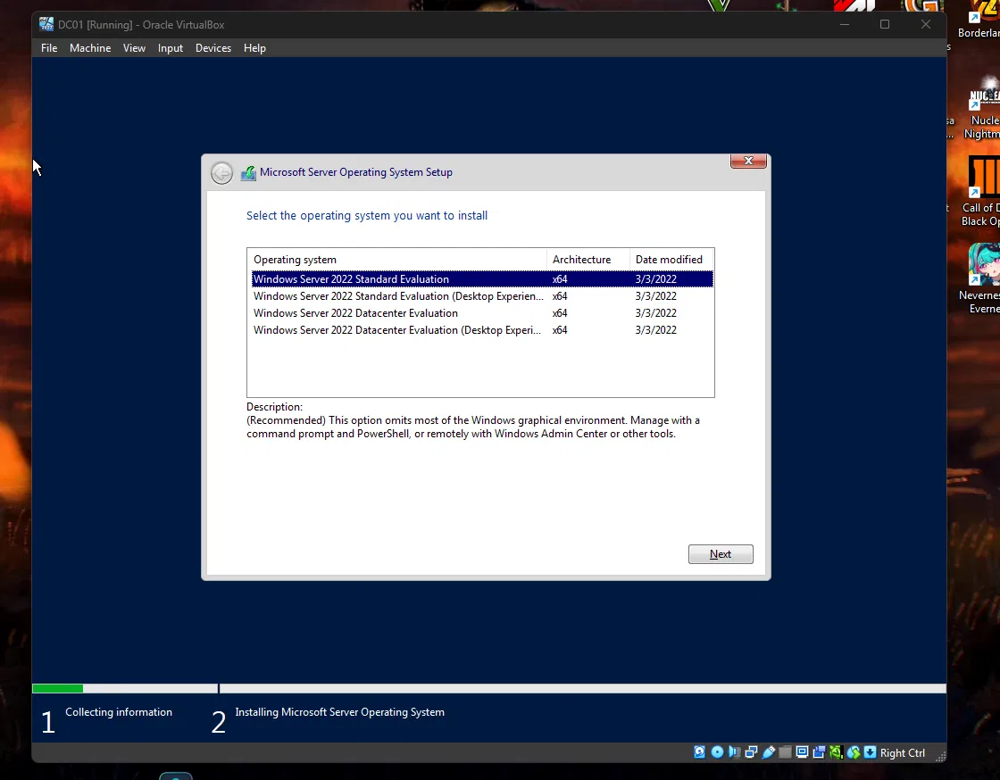
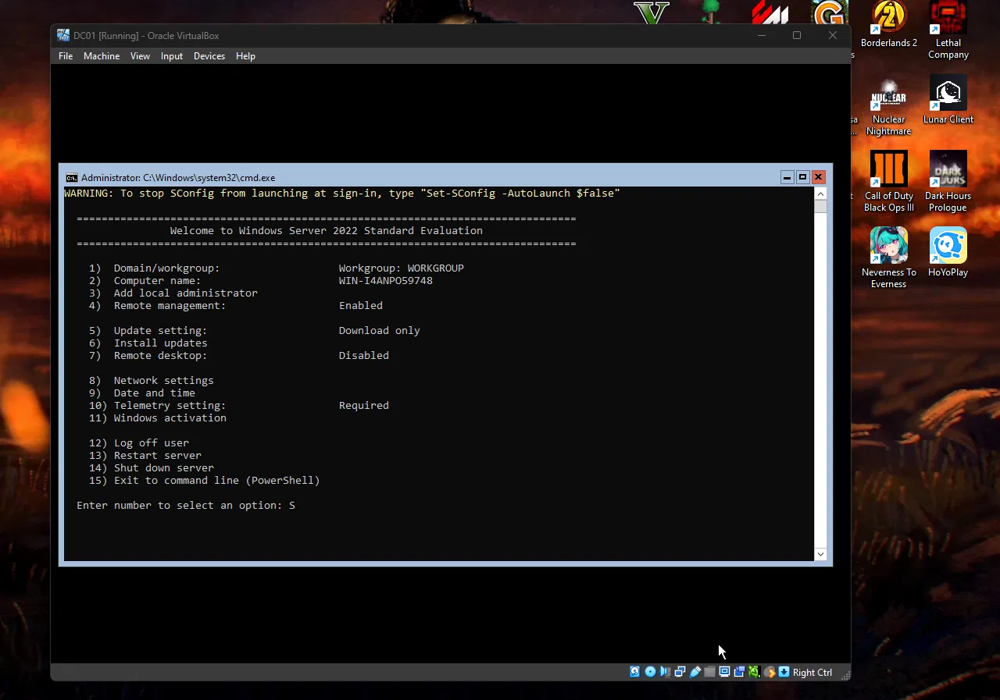
- Installed Server Core by mistake (missed selecting "Desktop Experience"). Learned that Microsoft doesn't allow converting between Server Core and Desktop Experience after install — required a clean reinstall.
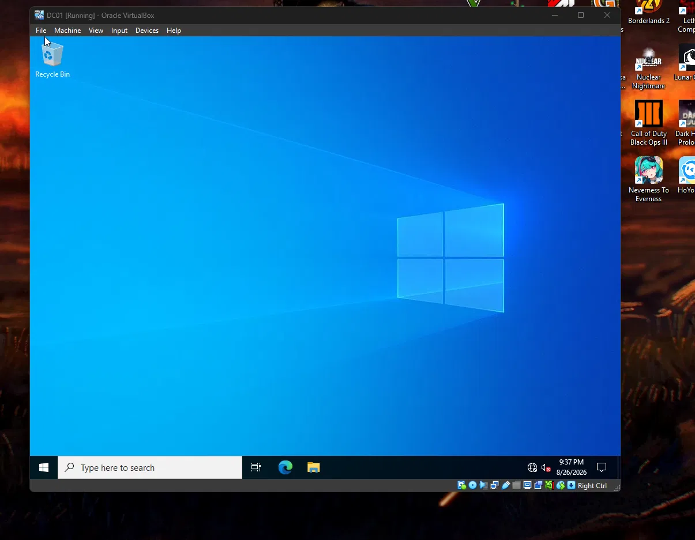
- Reinstalled and confirmed the correct edition.

**Installing Active Directory Domain Services:**
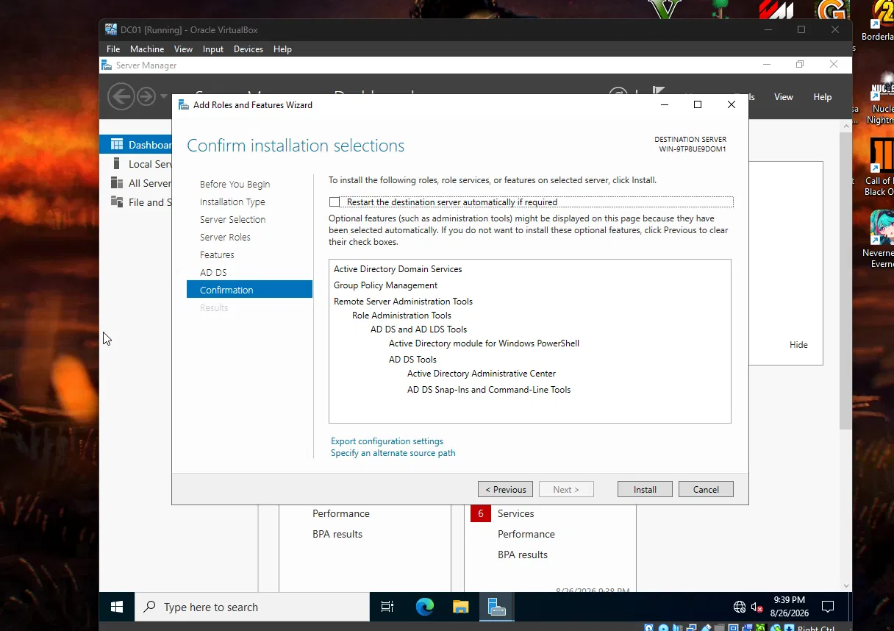
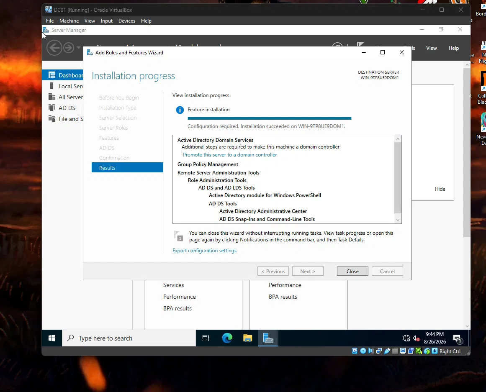
- Installed the Active Directory Domain Services role.

**Success:**

- Promoted the server to a domain controller for **corp.local**.
